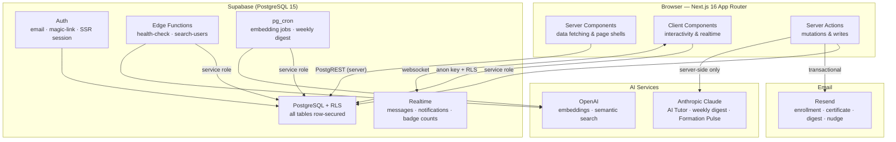
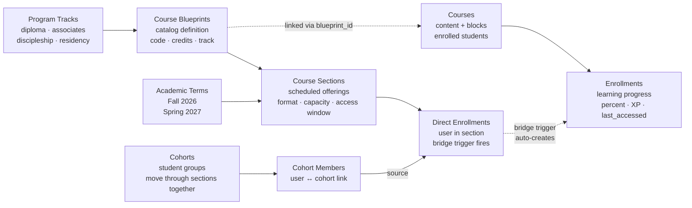
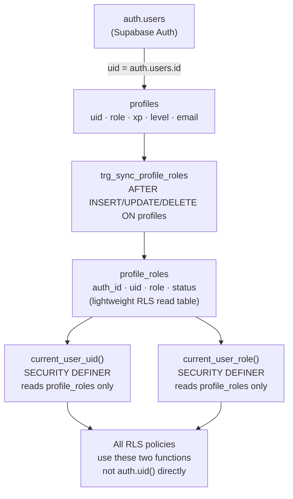
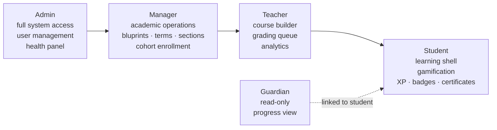

<div align="center">


### A fast, secure, ministry-ready Learning Management System  
**built for churches, seminaries, and faith communities**

[](./LICENSE)
[](./CHANGELOG.md)
[](https://nextjs.org)
[](https://supabase.com)
[](https://www.typescriptlang.org)
[](https://tailwindcss.com)
[](/.github/workflows/ci.yml)

[Features](#features) · [Architecture](#architecture) · [Getting Started](#getting-started) · [How-To](#how-to) · [Changelog](./CHANGELOG.md) · [License](#license)

</div>

---

## What is ChurchCore LMS?

ChurchCore LMS is an **open-source, production-ready learning platform** purpose-built for churches and faith communities. It handles the full academic lifecycle — from defining ministry programs and scheduling courses, to enrolling students in cohorts, tracking progress block-by-block, and issuing completion certificates.

**This is not a generic LMS wrapper.** Every design decision reflects the specific needs of ministry education:

- Volunteer training tracks with defined start/end terms
- Discipleship cohorts that move through courses together
- Multi-campus program tracks with shared blueprints
- Pastoral oversight of student formation progress
- AI-generated weekly formation nudges delivered pastor-voice
- AGPL-3.0 licensed — free to self-host; commercial/white-label requires a commercial license

---

## Features

### Learning Experience

| Feature | Details |
|---|---|
| **Block-based course builder** | Pages, videos, quizzes, assignments, file resources, external links, discussion threads |
| **Interactive learning shell** | Collapsible module sidebar, prev/next navigation, block-level progress tracking |
| **Auto-graded quizzes** | Multiple choice with per-question point values, attempt limits, and instant feedback |
| **Assignment submission** | Text submissions with instructor grading, rubric scoring, and inline feedback |
| **Discussion threads** | Per-block discussion boards visible to all enrolled students |
| **Video embedding** | YouTube, Vimeo, or native HTML5 video |
| **Certificate issuance** | Auto-issued on course completion with letter grade and unique certificate number |
| **PDF certificate download** | `@react-pdf/renderer`-powered certificate with name, course, grade, and date |

### Gamification & Motivation

| Feature | Details |
|---|---|
| **XP system** | Awarded on block completion, quiz scores (grade-scaled), assignment grading, and course completion |
| **10-level progression** | Automatic level-up via `calculate_level()` SQL function; thresholds: 100 → 250 → 500 → 1000 → 2000 → 4000 → 8000 → 15000 → 30000 XP |
| **Leaderboard** | Top 50 students with podium placement, level bars, and personal rank |
| **Formation Pulse** | Weekly AI-generated pastoral nudge — trajectory-classified, cohort-percentile-aware, delivered via in-app notification and email |
| **Badges** | Earned on course completion and milestones |

### Academic Structure

| Feature | Details |
|---|---|
| **Program tracks** | Multi-year pathways: diplomas, associate degrees, discipleship, residency, leadership |
| **Course blueprints** | Reusable catalog definitions with course code, credits, and track placement |
| **Academic terms** | Named scheduling windows (Fall 2026, Spring 2027) with bounded dates |
| **Course sections** | Scheduled blueprint offerings with delivery format (hybrid / self-paced), capacity, and access windows |
| **Cohorts** | Student groups that move through a sequence of sections together |
| **Direct enrollment** | Bridge trigger auto-creates course enrollment from section enrollment |
| **Bulk enrollment** | Staff search-and-enroll UI per course with role guard |

### Administration & Communication

| Feature | Details |
|---|---|
| **Role system** | `admin`, `manager`, `teacher`, `student` with ENUM enforcement at DB layer |
| **User management** | Paginated admin panel with role assignment and XP/level display |
| **Announcements** | Staff-authored with audience targeting: all, course members, or specific cohort |
| **Threaded messaging** | Direct and group threads with real-time unread badge counts |
| **Notifications** | In-app bell with full `/notifications` center, type icons, and dismiss-all |
| **Guardian links** | Parent/guardian accounts with read-only progress view |
| **Course analytics** | Per-course class stats, at-risk detection, CSV export |
| **Grading queue** | `/submissions` with status filters and inline grade + feedback forms |
| **AI Tutor** | Claude-powered question assistant embedded in the learning shell |
| **Semantic search** | OpenAI embeddings-backed course content search via `⌘K` modal |
| **Weekly AI digest** | Anthropic-powered personalized learning summary (cron-triggered) |
| **System health panel** | Admin dashboard with live checks for DB, embedding jobs, RLS helpers, and bridge sync |

### Infrastructure & Security

| Feature | Details |
|---|---|
| **Row Level Security** | All tables secured at DB layer — zero trust of client-side state |
| **RLS helper functions** | `current_user_uid()` and `current_user_role()` — SECURITY DEFINER, read from `profile_roles` (not `profiles`) to prevent recursion |
| **Service role isolation** | Service role key is server-side only; never in client components or `NEXT_PUBLIC_` vars |
| **Error boundaries** | Route-level boundaries for admin, courses, learn shell, and dashboard; never expose stack traces in production DOM |
| **CI/CD pipeline** | GitHub Actions: lint → typecheck → unit tests → build; e2e on PRs; manual approval gate for production |
| **Test suite** | Vitest + Testing Library; 72+ unit tests; per-file coverage thresholds enforced in CI |
| **Materialized view** | `mv_academic_performance` with SECURITY DEFINER access functions |
| **WCAG 2.1 AA** | Skip link, `aria-expanded`, `role="dialog"`, `aria-live`, `:focus-visible` |
| **Mobile-first** | 5-tab fixed bottom nav, iOS safe-area insets, mobile admin drawer |

---

## Architecture

### System Overview



### Academic Data Model

The academic structure is the defining architectural feature — a clean separation between the **catalog** (what you teach), the **schedule** (when you teach it), and **delivery** (tracking students through it).



### Identity & Security Model



> **Why `profile_roles`?** Direct `profiles` queries inside RLS policies cause infinite recursion. The lightweight `profile_roles` table — kept in sync by a trigger — breaks the cycle and keeps every read under 1 ms.

### Role Hierarchy



---

## Tech Stack

| Layer | Technology | Notes |
|---|---|---|
| Framework | [Next.js 16](https://nextjs.org) (App Router) | Server Components, Server Actions, Turbopack |
| Language | TypeScript 5 | Strict mode |
| Database | Supabase (PostgreSQL 15) | RLS on all tables, pg_cron, `SECURITY DEFINER` functions |
| Auth | Supabase Auth | Email/password + magic link; SSR session via `@supabase/ssr` |
| Styling | Tailwind CSS 3 + shadcn/ui | `tailwind-merge`, `class-variance-authority` |
| Rich text | Tiptap 3 | Course block content, announcements |
| AI — Tutor | [Anthropic Claude](https://anthropic.com) (`claude-haiku-4-5`) | Server-side only; zero PII in prompts |
| AI — Embeddings | [OpenAI](https://openai.com) | `text-embedding-3-small`; semantic course search |
| Email | [Resend](https://resend.com) | Enrollment, certificate, digest, Formation Pulse |
| Testing | [Vitest](https://vitest.dev) + Testing Library | 72+ unit tests; Proxy mock chain for Supabase |
| CI/CD | GitHub Actions | Lint → typecheck → test → build → staging gate → production |
| Deployment | [Vercel](https://vercel.com) | Edge-optimized; cron via `vercel.json` |
| PDF | `@react-pdf/renderer` | Server-rendered certificate PDFs |
| Charts | Recharts + Tremor | Course analytics, admin dashboards |

---

## Getting Started

### Prerequisites

- **Node.js 18+**
- A **[Supabase](https://supabase.com)** project (free tier works)
- An **[Anthropic](https://anthropic.com)** API key (for AI Tutor and weekly digest)
- A **[Resend](https://resend.com)** API key (for transactional email)
- A **[Vercel](https://vercel.com)** account (for deployment — or any Node.js host)

### 1. Clone and install

```bash
git clone https://github.com/ricardojjulia/ChurchCore-LMS.git
cd ChurchCore-LMS
npm install
```

### 2. Create your Supabase project

1. Go to [supabase.com](https://supabase.com) → **New project**
2. Note your **Project URL**, **Anon key**, and **Service role key** (Settings → API)
3. Install the Supabase CLI:

```bash
npm install -g supabase
supabase login
supabase link --project-ref YOUR_PROJECT_REF
```

### 3. Environment variables

```bash
cp .env.example .env.local
```

Edit `.env.local`:

```env
# Supabase (required)
NEXT_PUBLIC_SUPABASE_URL=https://your-project.supabase.co
NEXT_PUBLIC_SUPABASE_ANON_KEY=your-anon-key

# Server-side only — never prefix with NEXT_PUBLIC_
SUPABASE_SERVICE_ROLE_KEY=your-service-role-key

# AI features — server-side only
ANTHROPIC_API_KEY=your-anthropic-key
OPENAI_API_KEY=your-openai-key

# Email (optional — features degrade gracefully if absent)
RESEND_API_KEY=your-resend-key
RESEND_FROM_EMAIL=noreply@yourdomain.com

# Cron auth (used by API routes called by Vercel/pg_cron)
CRON_SECRET=a-long-random-string
```

> **Security note:** `SUPABASE_SERVICE_ROLE_KEY`, `ANTHROPIC_API_KEY`, and `OPENAI_API_KEY` are server-side only. They must **never** appear in client components or be prefixed `NEXT_PUBLIC_`. All AI calls are proxied through `/api/ai` and `/api/digest`.

### 4. Apply database migrations

```bash
supabase db push
```

This applies all migrations in order — tables, RLS policies, helper functions, triggers, materialized views, pg_cron schedules, and the academic structure schema.

### 5. Create your first admin user

1. Start the app locally: `npm run dev`
2. Open [http://localhost:3000](http://localhost:3000) and sign up with your email
3. In the Supabase dashboard → Table Editor → `profile_roles`, set `role = 'admin'` for your row
4. Refresh the app — you now have full admin access

### 6. Run the demo (optional)

The repo ships a guarded destructive reset that builds a full demo school: 6 program tracks, 20 course blueprints, 6 cohorts, 27 students, 138 enrollments, course content, grades, and calendar events.

```bash
node scripts/reset-demo-data.mjs --confirm --retain-email=you@example.com
```

> ⚠️ This **deletes all non-retained data** in the linked Supabase project. Only run against a dedicated demo/dev project.  
> See [docs/demo-data.md](./docs/demo-data.md) for a full description of what it creates.

### 7. Deploy to Vercel

[](https://vercel.com/new/clone?repository-url=https://github.com/ricardojjulia/ChurchCore-LMS)

Add all environment variables in your Vercel project settings (Settings → Environment Variables).

For the full GitHub Actions CI/CD setup with staging gate and production deploy, see [docs/github-setup.md](./docs/github-setup.md).

---

## How-To

### Add a course

1. Admin or Manager → **Courses** → **New Course**
2. Fill in title, description, and settings → **Save**
3. Use the **Course Builder** to add modules and blocks
4. Publish the course when ready
5. Optionally link the course to a **Blueprint** (Admin → Blueprints → Edit → Link course)

### Create a program track

1. Admin → **Programs** → **New Track**
2. Add **Blueprints** to the track (reusable course definitions)
3. Create **Terms** (Admin → Terms → New Term) for each academic period
4. **Schedule sections** — Blueprint → New Section → pick term, format, dates, capacity
5. Create a **Cohort** and assign students
6. Enroll the cohort into sections via **Admin → Cohorts → [Cohort] → Enroll in Section**

### Enroll students in a course

**Via cohort (recommended):**  
Admin → Cohorts → select cohort → Enroll in Section → pick the blueprint's section

**Direct enrollment:**  
Course → Enroll → search by name or email → click Enroll

### Configure email notifications

1. Add `RESEND_API_KEY` and `RESEND_FROM_EMAIL` to your environment
2. Email is sent automatically on: student enrollment, certificate issuance, weekly AI digest, and Formation Pulse nudges
3. Students can opt out of emails via their profile → **Email notifications** toggle (respects `email_digest_enabled`)

### Configure AI features

- **AI Tutor** — add `ANTHROPIC_API_KEY` to your environment; the tutor appears automatically in the learning shell
- **Semantic search** — add `OPENAI_API_KEY`; content is embedded via pg_cron automatically after publishing
- **Formation Pulse** — add both `OPENAI_API_KEY` and `RESEND_API_KEY`; runs Monday 9 AM via Vercel cron

### Set up CI/CD

See [docs/github-setup.md](./docs/github-setup.md) for:
- Branch protection rules
- Required GitHub Actions secrets
- Staging environment configuration
- Production deploy with manual approval gate

### Customise the sidebar navigation

See [docs/HOWTO-sidebar-nav.md](./docs/HOWTO-sidebar-nav.md) for adding links, changing icons, toggling collapse behavior, and hiding the nav on specific routes.

### Run the test suite

```bash
npm run test:run          # unit tests only (fast)
npm run test:coverage     # with coverage report
npm run test:ci           # full CI run with thresholds
```

See [docs/testing.md](./docs/testing.md) for coverage thresholds, test patterns, mock strategy, and e2e setup.

---

## Project Structure

```
src/
├── app/
│   ├── actions/               # Server actions — learning, enrollment, messages, cohorts
│   ├── api/                   # API routes — AI proxy, search, calendar, digest, health
│   ├── admin/                 # Cohorts, sections, terms, blueprints, users, health panel
│   ├── courses/[id]/
│   │   ├── build/             # Course builder
│   │   ├── learn/             # Learning shell + block players
│   │   ├── complete/          # Completion page + certificate
│   │   ├── enroll/            # Bulk enrollment UI
│   │   ├── analytics/         # Instructor analytics + CSV export
│   │   └── submissions/       # Grading queue
│   ├── dashboard/             # Role-aware dashboard (student · teacher · admin)
│   ├── leaderboard/           # XP leaderboard — top 50 with podium
│   ├── notifications/         # Full notification center
│   ├── performance/           # Student GPA and progress view
│   ├── certificates/          # Earned certificate gallery
│   ├── messages/              # Threaded messaging
│   ├── guardian/              # Guardian progress view
│   └── announcements/         # Announcement feed + composer
├── components/
│   ├── learning/              # LearningShell, BlockPlayer, QuizPlayer, DiscussionPlayer
│   ├── layout/                # Sidebar, GlobalSearch, MobileBottomNav, NotificationBell
│   └── dashboard/             # StudentDashboard, InstructorDashboard, AdminDashboard
├── hooks/                     # useRealtimeChannel, useNotifications, useMessages
├── lib/
│   ├── auth/                  # Permission helpers (isAdmin, isStaff, …)
│   ├── formation/             # Formation Pulse — trajectory classifier
│   └── monitoring.ts          # captureError() — error ID generation
├── tests/                     # Vitest setup, e2e specs, test fixtures
├── types/                     # Shared TypeScript interfaces
└── utils/
    ├── supabase/              # client · server · service helpers + __mocks__
    ├── grading.ts             # calculateLetterGrade, calculatePercentage, isPassing
    └── certificate.ts         # generateCertificateData, formatCompletionDate
.github/
├── workflows/
│   ├── ci.yml                 # lint → typecheck → test → build
│   ├── e2e.yml                # edge function e2e (PR-only)
│   └── release.yml            # staging gate → manual approval → production
└── CODEOWNERS                 # migrations and workflows require maintainer review
docs/
├── decisions/                 # ADR-2025-001 through ADR-2025-007, COUNCIL-2025-008 through 011
├── github-setup.md            # Secrets, branch protection, CI/CD reference
├── testing.md                 # Unit tests, coverage, e2e guide
├── demo-data.md               # Demo reset documentation
└── academic-program-workflows.md  # Tracks, blueprints, terms, cohorts walkthrough
supabase/
├── functions/
│   ├── search-users/          # Edge Function — role-gated user search with audit log
│   └── system-health-check/   # Edge Function — DB, embedding, RLS, and bridge checks
├── migrations/                # 50+ ordered SQL migrations
└── seed.test.sql              # Deterministic test seed (fixed UUIDs)
scripts/
├── reset-demo-data.mjs        # Guarded destructive demo reset
├── check-version.mjs          # CHANGELOG ↔ package.json version sync
└── ci-setup-test-env.mjs      # CI helper — sets test-user passwords via Admin API
```

---

## Architecture Decisions

Full records in [docs/decisions/](./docs/decisions/). Key decisions:

| Document | Decision |
|---|---|
| [ADR-2025-001](./docs/decisions/ADR-2025-001.md) | PostgreSQL RLS as sole authorization layer |
| [ADR-2025-002](./docs/decisions/ADR-2025-002.md) | Academic structure: blueprints → sections → terms → cohorts |
| [ADR-2025-003](./docs/decisions/ADR-2025-003.md) | Block-based course content model |
| [ADR-2025-004](./docs/decisions/ADR-2025-004.md) | XP and leveling system |
| [ADR-2025-005](./docs/decisions/ADR-2025-005.md) | Server Actions pattern for all mutations |
| [ADR-2025-006](./docs/decisions/ADR-2025-006.md) | OpenAI embeddings for semantic course search |
| [ADR-2025-007](./docs/decisions/ADR-2025-007.md) | AGPL-3.0 licensing model |
| [COUNCIL-2025-011](./docs/decisions/COUNCIL-2025-011.md) | Formation Pulse — AI-generated weekly pastoral nudges |

### The RLS Recursion Fix

The most common Supabase pitfall is writing RLS policies that query `profiles` directly — which causes infinite recursion because reading `profiles` triggers the policy that reads `profiles`. ChurchCore LMS solves this permanently via `profile_roles`:

```sql
-- Two SECURITY DEFINER functions read only from profile_roles (never profiles)
CREATE FUNCTION current_user_uid()  RETURNS uuid  AS $$ SELECT uid  FROM profile_roles WHERE auth_id = auth.uid() $$;
CREATE FUNCTION current_user_role() RETURNS text   AS $$ SELECT role FROM profile_roles WHERE auth_id = auth.uid() $$;

-- A trigger keeps profile_roles in sync automatically
CREATE TRIGGER trg_sync_profile_roles
  AFTER INSERT OR UPDATE OR DELETE ON profiles
  FOR EACH ROW EXECUTE FUNCTION sync_profile_roles();
```

All RLS policies use `current_user_uid()` and `current_user_role()` — never `auth.uid()` or direct `profiles` reads.

---

## Governance

ChurchCore LMS uses a **six-member Architecture Council** for all significant technical decisions. The council evaluates proposals across six lenses — architecture, engineering, security, product, QA, and data — and produces formal decision records before implementation begins.

Decision documents live in [docs/decisions/](./docs/decisions/). The council system itself is described in [docs/CODE-FACTORY-SYSTEM-PROMPT.md](./docs/CODE-FACTORY-SYSTEM-PROMPT.md).

---

## Contributing

See [CONTRIBUTING.md](./CONTRIBUTING.md) for:
- Commit conventions and branch naming
- PR requirements (typecheck, tests, coverage thresholds)
- Migration authoring rules (RLS required, no `SET row_security = off`)
- Security constraints (no PII in AI prompts, service role server-side only)
- Architecture Council procedures for significant changes

---

## Licensing

### Open Source (AGPL-3.0)

ChurchCore LMS is licensed under the **GNU Affero General Public License v3.0**.

This means:
- ✅ Free to self-host for any church or organization
- ✅ Free to study, modify, and contribute back
- ✅ Free to use in ministry, education, and non-profit contexts
- ⚠️ If you deploy a modified version as a service, you must open-source the changes
- ❌ Commercial SaaS forks, white-label products, or embedded licensing require a **commercial license**

### Commercial License

For denominations, church software vendors, or organizations that need:
- White-label branding without AGPL disclosure requirements
- Embedded use in a larger commercial product
- Dedicated enterprise support

Contact: **ricardojjulia@gmail.com**

---

## Changelog

See [CHANGELOG.md](./CHANGELOG.md) for the full version history.

**Latest:** [v0.20.1](./CHANGELOG.md#0201--2026-06-18) — Health check fixes, RPC migration, demo data consistency  
**Previous:** [v0.20.0](./CHANGELOG.md#0200--2026-06-16) — Enrollment emails, certificate emails, announcement course selector  

---

<div align="center">

Built with care for the global church.  
[AGPL-3.0](./LICENSE) © 2026 Ricardo Julia

</div>
