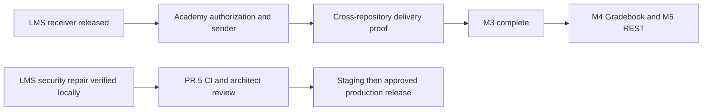

# LMS MVP and verification status

Updated September 18, 2026. Application version 0.26.5 is prepared in PR #5 for architect review.

| Area | Evidence and remaining scope |
|---|---|
| Standalone LMS | Admin/learner login and dashboards, courses, sections, health, reports, certificates, OneRoster and group views exercised locally. Core enrollment, XP, certificate, guardian, reporting and health behavior is covered by E2E; this is not exhaustive product certification. |
| Academic structure and content | Real transactional hierarchy, enrollment, access-window and published-content tests. Terms and section headers preserve date-only boundaries across server timezones. |
| Groups | Active-tenant RLS, author/parent guards, existing platform-admin reads, section-bound member removal, database-enforced group capacity and redacted errors. Accessible title/reply fields; create/reply/delete and membership removal/reassignment verified with distinct Auth/domain identities. Desktop 1280 px and mobile 390 px have no settled horizontal overflow. |
| AI retrieval | Tenant, active-account, enrollment and inactive-embedding checks pass in the database. No paid model invocation. |
| OneRoster M3 LMS | Receiver PR #3 and release repair #4 merged and released. Signed receipt stages for explicit review and never creates Auth users. |
| Shared OneRoster milestone | Academy sender and cross-repository delivery proof remain open, requiring separate repository authorization. M4 Gradebook and M5 REST/OpenAPI remain later work. No certification claim. |
| Dependencies | Next.js 16.3.5, TipTap 3.31.3, Vitest 4.1.11. Current lockfile audit: zero vulnerabilities. No new dependency upgrade in September 18 repair. |
| Verification | 240 unit tests with existing coverage gates; 16 SQL suites/340 assertions; 8 E2E files/77 tests against a production build on a fresh isolated local Supabase stack. Type/lint/version/build, application DB lint, migration reapply, OneRoster concurrency, RLS and client-secret scans pass. |
| Publication | PR #5 remains subject to current-head CI and architect review. Main be17a76 includes controlled Vercel promotion and a check-in policy. Release 35148363218 completed staging but remains at the Production approval gate; its latest-main check would reject this stale commit. The current-main release is queued behind it. |

Current evidence is in `.ai-factory/runs/daily-churchcore-lms-2026-09-18/`.
Previous daily snapshots remain historical. The September 18 run used its own disposable
Supabase stack on ports 64321/64322; it does not alter the original local or cloud
schema. Realtime, studio and analytics services were excluded to reduce local
resource use, so live subscription delivery is not part of the browser proof.
Read-only reports emitted initial chart-size warnings; final group/date views
had no new application console errors. Hosted CI results are on
[PR #5](https://github.com/ricardojjulia/ChurchCore-LMS/pull/5).

