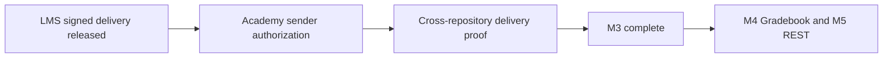

# LMS MVP and verification status

Updated September 16, 2026. Application version 0.26.3 is prepared for review.

| Area | Evidence and remaining scope |
|---|---|
| Standalone LMS | Admin and learner dashboards, login, OneRoster configuration and group views exercised with synthetic local accounts. Core course/assessment/certificate features remain implemented; this daily smoke is not an exhaustive product certification. |
| Academic structure and content | Repaired transactional SQL tests cover hierarchy, enrollment, access windows and published content. Auth and domain IDs are deliberately distinct in regression fixtures. |
| Groups | Tenant-scoped actions and database guards; threads/replies update without navigation; mobile discussion layout fits 390 px. |
| AI retrieval | Tenant, active-account, enrollment and inactive-embedding checks pass at the database boundary. No live paid model generation was run. |
| OneRoster M3 LMS | PR #3 and release repair #4 merged; September 15 staging and production release succeeded. Signed receipt stages for explicit review and never creates Auth users. |
| OneRoster shared milestone | Academy sender and cross-repository delivery proof remain open and require separate repository authorization. M4 Gradebook and M5 REST/OpenAPI are later milestones. No certification claim. |
| Dependencies | Next.js 16.3.5, TipTap 3.31.3, Vitest 4.1.11. Lockfile audit: zero vulnerabilities at verification time. |
| Verification | 237 unit tests and current coverage gates pass; 302 real SQL assertions, database lint, concurrency, type/lint/version/build checks pass locally. Fresh full-stack hosted checks are required before release. |

The daily run records live in `.ai-factory/runs/daily-churchcore-lms-2026-09-16/`.
Its migration and CI changes require an architect review under CODEOWNERS.
The local isolated Supabase stack stalled while starting services; the SQL
fallback used a separate database with preserved owners and grants. Browser
smoke used synthetic data on the existing local service stack, without applying
this migration there. Those checks do not imply cloud deployment.

