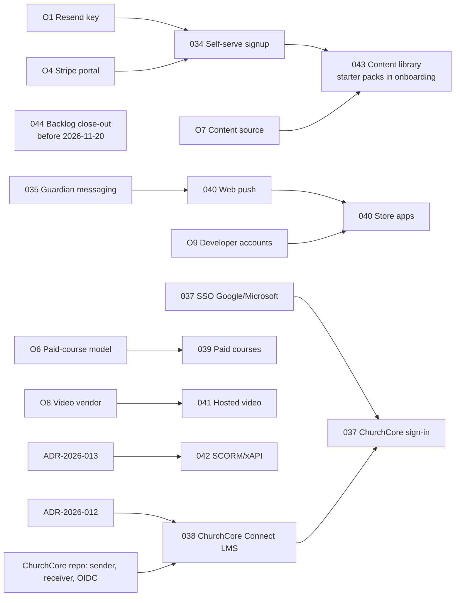

# ChurchCore LMS — Q4 2026 Implementation Plan

## Version 0.36.1 → 1.0 · Drafted 2026-09-26

**Status:** DRAFT. Every council document below is a draft awaiting its council vote and owner approval. Nothing is implemented from this plan until its council document is ratified, per `docs/CODE-FACTORY-SYSTEM-PROMPT.md`.

**Replaces:** `docs/implementation-plan-2026-sprint2-4.md`. Its Sprints 2A–3 shipped in v0.23–0.25, and Sprint 4 was never defined; it became Council Review 3.

**Inputs:**
- the owner's direction on 2026-09-26: cover everything open, plan every capability marked ❌, and make ChurchCore the ChMS integration;
- `docs/reviews/2026-09-26-mvp-competitive-status.md`;
- Council Review 3.

---

## 1. Scope: every open item

### Capabilities marked ❌ in the status report

| Capability | Plan | Council |
|---|---|---|
| Self-serve org signup and trial | Signup, email verification, 14-day trial, plan picker, abuse controls | [COUNCIL-2026-034](council/COUNCIL-2026-034.md) |
| Teacher ↔ guardian messaging | Allowed pairs enforced in the database; threads about one student | [COUNCIL-2026-035](council/COUNCIL-2026-035.md) |
| Rubric grading | Reusable rubrics, snapshots, grid integration, criterion analytics | [COUNCIL-2026-036](council/COUNCIL-2026-036.md) |
| SSO / social login | Google and Microsoft; ChurchCore OIDC; org enforcement | [COUNCIL-2026-037](council/COUNCIL-2026-037.md) |
| **ChMS integration → ChurchCore** | ChurchCore Connect: signed two-way sync, staged apply, plus ChurchCore sign-in | [COUNCIL-2026-038](council/COUNCIL-2026-038.md), [ADR-2026-012](decisions/ADR-2026-012.md) |
| Paid courses / storefront | Stripe Connect (church collects directly) | [COUNCIL-2026-039](council/COUNCIL-2026-039.md), **owner decision** |
| Native mobile app / push | Phase 1 web push; Phase 2 Capacitor store apps | [COUNCIL-2026-040](council/COUNCIL-2026-040.md), ADR-2026-014 (to write) |
| Hosted video | Managed provider, signed playback, reliable `must_view` | [COUNCIL-2026-041](council/COUNCIL-2026-041.md), ADR-2026-015 (vendor, to write) |
| SCORM / xAPI | Sandboxed runtime on a separate origin, plus an LRS endpoint | [COUNCIL-2026-042](council/COUNCIL-2026-042.md), [ADR-2026-013](decisions/ADR-2026-013.md) |
| Ready-made content library | Platform template library, adopt as copy or linked, starter packs | [COUNCIL-2026-043](council/COUNCIL-2026-043.md), **owner decision** |

### Open engineering items

| Item | Plan | Council |
|---|---|---|
| Placeholder block types (`survey`, `flashcard_set`, `checklist`, `section`, `certificate`) | Build the first three; remove the last two | [COUNCIL-2026-044](council/COUNCIL-2026-044.md) |
| `updateCohort` has no UI (**exemption expires 2026-11-20**) | Cohort edit form | COUNCIL-2026-044 |
| Stale `docs/factory-status.md` | Rewritten in this PR | Done |

### Owner actions (configuration and decisions; no code)

| # | Item | Blocks |
|---|---|---|
| O1 | Set `RESEND_API_KEY` and a verified `RESEND_FROM_EMAIL` in Vercel production | App email today; **COUNCIL-2026-034** |
| O2 | Production synthetic setup (`scripts/prod-synthetic-bootstrap.mjs` plus the `SYNTHETIC_*` settings) | Post-release checks |
| O3 | Schedule the weekly digest (say the word; the SQL is ready) | Digest emails |
| O4 | Configure the Stripe Customer Portal (open since Sprint 1) | Billing portal; COUNCIL-2026-034 conversion |
| O5 | Closed beta: onboard Biblos plus 2–3 congregations; check the triage queue daily | Evidence for ordering Sprints 8–10 |
| O6 | Paid courses: Option A (church collects, no platform fee) or B (platform fee, supersedes ADR-2026-007) | COUNCIL-2026-039 |
| O7 | Content source: first-party, partner, or both | COUNCIL-2026-043 |
| O8 | Video vendor budget (Mux vs Cloudflare Stream) | ADR-2026-015 / COUNCIL-2026-041 |
| O9 | Apple and Google developer accounts | COUNCIL-2026-040 Phase 2 |

---

## 2. Sprint plan

Sprints are about two weeks each. Each council document is voted before its sprint starts.

### Sprint 5: launch foundation (v0.37 → v0.38)

| # | Item | Council | Effort | Depends on |
|---|---|---|---|---|
| 1 | Backlog close-out: survey, flashcards, checklist; cohort edit; placeholder cleanup | 044 | Medium | Nothing; **must land before 2026-11-20** |
| 2 | Self-serve signup and trial | 034 | Medium–High | O1 (`RESEND_API_KEY`), O4 |

### Sprint 6: trust and identity (v0.39 → v0.40)

| # | Item | Council | Effort | Depends on |
|---|---|---|---|---|
| 3 | Teacher ↔ guardian messaging | 035 | Medium | Nothing |
| 4 | SSO: Google and Microsoft (the ChurchCore provider comes in Sprint 7) | 037 | Medium | Nothing |

### Sprint 7: ChurchCore Connect (v0.41 → v0.42)

| # | Item | Council | Effort | Depends on |
|---|---|---|---|---|
| 5 | LMS side: receiver, staging, preview and apply, outbound queue, admin UI | 038 | High | ADR-2026-012 accepted |
| 6 | ChurchCore side: sender, receiver, OIDC provider, education-table retirement | ChurchCore repo council | High | Its own council and signed commits |
| 7 | "Sign in with ChurchCore" | 037 | Low | 5, 6 |

### Sprint 8: teaching depth and engagement (v0.43 → v0.44)

| # | Item | Council | Effort | Depends on |
|---|---|---|---|---|
| 8 | Rubric grading | 036 | Medium | Nothing |
| 9 | Web push (Phase 1) | 040 | Medium | Nothing (reuses 035 events) |

### Sprint 9: commerce and media (v0.45 → v0.46)

| # | Item | Council | Effort | Depends on |
|---|---|---|---|---|
| 10 | Paid courses (Stripe Connect) | 039 | High | O6 |
| 11 | Hosted video | 041 | High | O8, ADR-2026-015 |

### Sprint 10: content and interoperability (v0.47 → 1.0)

| # | Item | Council | Effort | Depends on |
|---|---|---|---|---|
| 12 | Starter content library and templates | 043 | Medium (plus content production) | O7 |
| 13 | SCORM and xAPI runtime | 042 | High | ADR-2026-013 |
| 14 | Store apps (Capacitor) | 040 Phase 2 | Medium | ADR-2026-014, O9 |

**1.0** is declared when Sprints 5–10 have shipped, the closed beta (O5) has run, and the status report's public-launch readiness is re-scored.

Closed-beta feedback (O5) can reorder Sprints 8–10. Sprints 5–7 are fixed: they are launch blockers or strategic.

---

## 3. Dependency graph

---

## 4. ChurchCore integration plan (summary of COUNCIL-2026-038)

**Goal:** a church running ChurchCore never retypes people into the LMS, and a pastor sees every member's course progress in ChurchCore.

| Direction | What moves | Rules |
|---|---|---|
| ChurchCore → LMS | People, church roles (mapped), families (as guardian links), groups and ministries (as cohorts), onboarding templates (as paths or auto-enroll) | Staged, previewed and applied; the first sync is always reviewed; admin-role changes are always reviewed; minors minimized; no pastoral or care data |
| LMS → ChurchCore | Enrollment, progress milestones, completion, certificate (with `/verify` link), path completion, and optionally attendance | No grades unless the org opts in; retry with backoff, then dead-letter |
| Identity | "Sign in with ChurchCore" (OIDC); identity links keyed on ChurchCore person IDs | Signing in never grants a role or membership by itself |

**Transport:** the LMS's existing Ed25519 signed-delivery protocol (`x-churchcore-key-id`, delivery IDs, a staleness window), with per-tenant key pairs. There's no shared database and no cross-product service keys.

**ChurchCore-side work** (in `ricardojjulia/ChurchCore`, under its council, factory, signed-commit and `tests/coverage-manifest.json` rules):
1. a connect settings page (key pair, pairing, revocation);
2. an allow-list sender;
3. a signed receiver for LMS events, which drives member records and `workflows`;
4. an OIDC provider;
5. retirement of `education_courses` / `education_enrollments`, with existing rows exported to the LMS.

A companion plan document goes into the ChurchCore repository when this plan is approved.

---

## 5. Cross-repository work outside this plan

- **OneRoster (ChurchCore Academy):** the Academy sender and cross-repository delivery proof (M3 completion), then M4 gradebook sync and M5 REST/OpenAPI. These are tracked by the Academy workstream (`docs/factory-status.md` history). The LMS receiver is done.

---

## 6. Execution rules (unchanged)

Every item follows `docs/CODE-FACTORY-SYSTEM-PROMPT.md`:

- council vote, then implementation from the council prompt;
- the PR ships its test surfaces (`npm run test:surface`, and the Browser & API job);
- the `pr-reviewer` gate plus a triage of the PR's comments, reviews and check runs;
- an approved release.

New dependencies (`web-push`, Capacitor, the video SDK, the SCORM runtime helpers) are named in their PRs.
